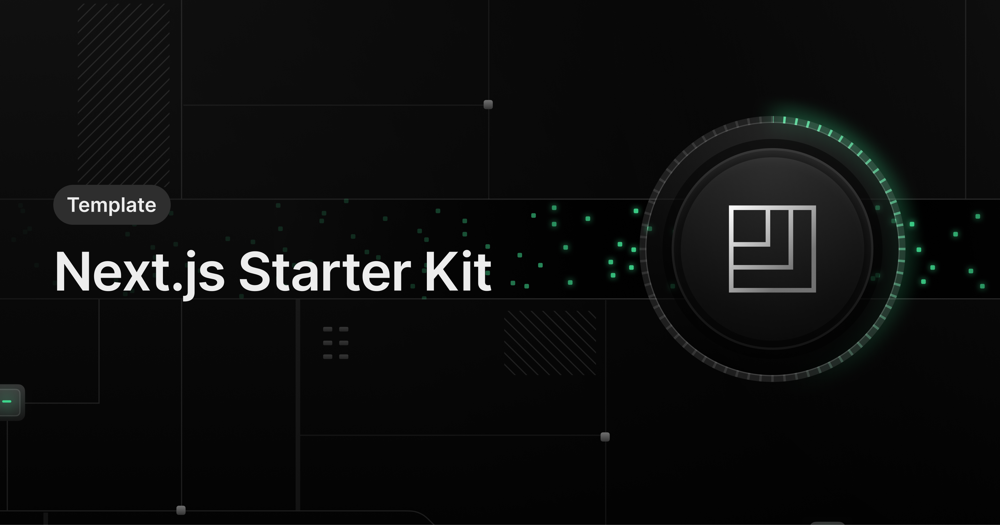

<a href="https://demo-nextjs-with-defer.vercel.app/">



  <h1 align="center">Next.js and Defer Demo</h1>
</a>

<p align="center">
 Explore how to schedule background tasks with Next.js and Defer
</p>

<p align="center">
    <a href="https://docs.defer.run/">Documentation</a>
    <span>&nbsp;·&nbsp;</span>
    <a href="https://www.defer.run/blog">Blog</a>
    <span>&nbsp;·&nbsp;</span>
    <a href="https://discord.gg/x2v84Vqsk6">Community</a>
    <span>&nbsp;·&nbsp;</span>
    <a href="https://github.com/defer-run/defer.client/discussions/categories/roadmap">Roadmap / RFCs</a>
</p>
<br/>

## Features

Defer makes it easy to schedule and offload long-running tasks, without leaving your Next.js application with:

- [Delayed Executions](https://www.defer.run/docs/features/delays)
- [CRONs](https://www.defer.run/docs/features/cron)
- [Workflows](https://www.defer.run/docs/guides/onboarding-workflow)
- Advanced configuration: [Retries](https://www.defer.run/docs/features/retries), [Concurrency](https://www.defer.run/docs/features/concurrency) or, [Cancellation](https://www.defer.run/docs/features/cancellation)

<br />

This Next.js Demo comes with a [CRON](./defer/dailyCron.ts) and 2 examples of Background Functions.

See how Defer fits perfectly with [Next.js Server Actions](./app/actions/actions.ts), enabling you to trigger Background Functions from [Client-Side Components](./app/page.tsx).

<br />

## Demo

You can view a fully working demo at [demo-nextjs-with-defer.vercel.app](https://demo-nextjs-with-defer.vercel.app/).

<br />

## Deploy to Vercel

1. First, click on the following button will fork this demo repository and deploy it on your Vercel account: [](https://vercel.com/new/clone?repository-url=https%3A%2F%2Fgithub.com%2Fdefer-run%2Fdefer.demo%2Ftree%2Fmaster%2Fnextjs%2Fapp-template%2F&project-name=nextjs-with-defer&repository-name=nextjs-with-defer&demo-title=nextjs-with-defer&demo-description=Perform%20long-running%20tasks,%20workflows%20and%20CRONs%20within%20your%20Next.js%20application.&demo-url=https%3A%2F%2Fdemo-nextjs-with-defer.vercel.app%2F&external-id=https%3A%2F%2Fgithub.com%2Fdefer-run%2Fdefer.demo%2Ftree%2Fmaster%2Fnextjs%2Fapp-template%2F&demo-image=https%3A%2F%2Fraw.githubusercontent.com%2Fdefer-run%2Fdefer.demo%2Fmaster%2Fnextjs%2Fapp-template%2Fapp%2Fog_image.png&integration-ids=)

2. Once deployed on Vercel, go on the [Defer Console to create an account](https://console.defer.run/).

3. Then, create a new Defer application by selecting your GitHub repository created from this template.

4. Finally, go to the [Defer Vercel Integration page](https://vercel.com/integrations/defer) (_Click "Add Integration"_) to connect your Vercel application with your Defer ones.

5. You are go to go! The tasks will now run on Defer, triggered from your Vercel demo application 🚀

<br />

## Clone and run locally

1. Create a Next.js app using this template with the `npx command`:

   ```bash
   npx create-next-app -e https://github.com/defer-run/defer.demo/tree/master/nextjs/app-template
   ```

2. Use `cd` to change into the app's directory

   ```bash
   cd name-of-new-app
   ```

3. You can now run the Next.js local development server:

   ```bash
   npm run dev
   ```

   The demo application should now be running on [localhost:3000](http://localhost:3000/).

> Check out [the docs for Local Development](https://www.defer.run/docs/get-started/development-testing#local-development).

<br />

> Follow our [Vercel Integration guide](https://www.defer.run/docs/integrations/vercel) to deploy your new repository to Defer and Vecerl without using the "Deploy to Vercel" button
